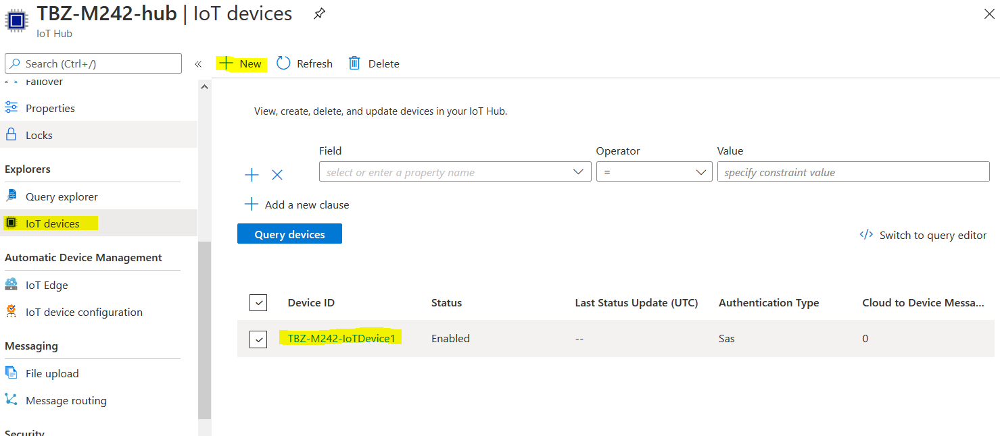
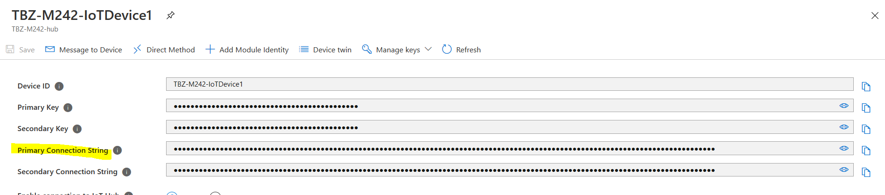
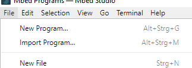
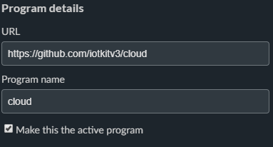
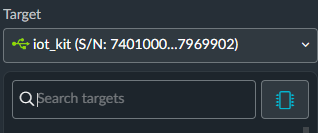
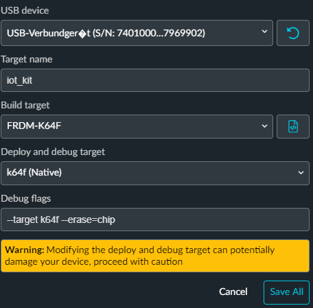
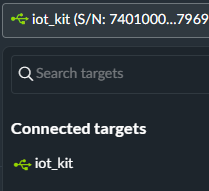
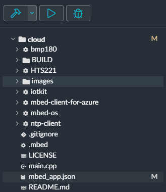
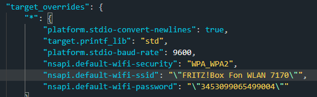
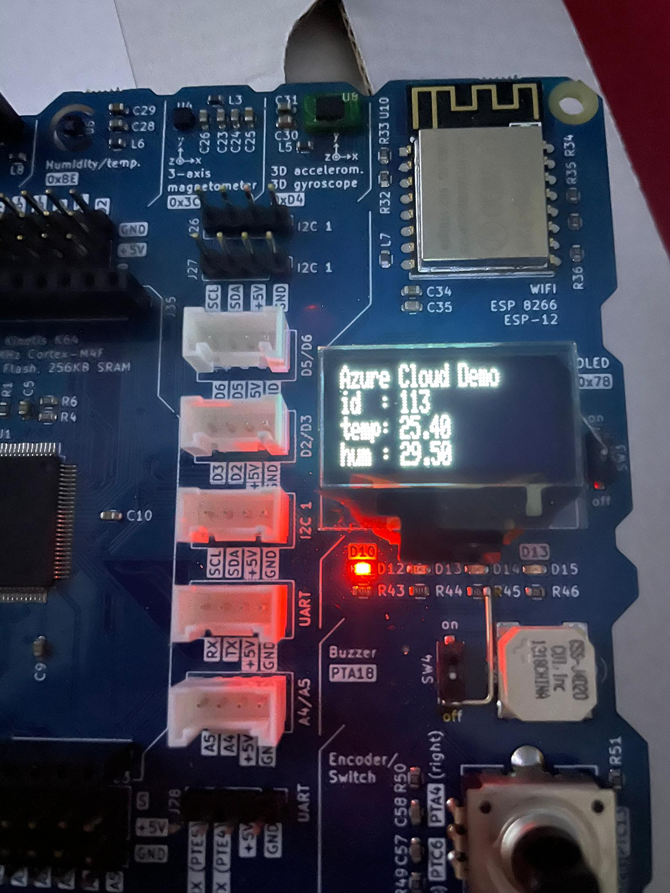

# m242-lb3-AZURE

### Inhaltsverzeichnis
* [Team  Übersicht]()
* [Projektbeschrieb]()
* [Gliederung]()
* [K1](https://github.com/cdrc-kppr/M242-lb3-AZURE#k1)
* [K2](https://github.com/cdrc-kppr/M242-lb3-AZURE#k2)
* [K3](https://github.com/cdrc-kppr/M242-lb3-AZURE#k3)
* [K4](https://github.com/cdrc-kppr/M242-lb3-AZURE#k4)
* [K5](https://github.com/cdrc-kppr/M242-lb3-AZURE#k5)
* [K6](https://github.com/cdrc-kppr/M242-lb3-AZURE#k6)

## Team Übersicht
* Luca Kiefer
* Haris Chandrakumar
* Cedric Kupper

## Projektbeschrieb

## K1
### Umgebung auf eigenem Notebook eingerichtet und voll funktionsfähig
#### Account auf os.mbed.com erstellt
#### Serial Driver installiert
#### Terminal Programm installiert

## K2
### Eigene Lernumgebung ist eingerichtet
#### Dokumentation vorhanden
#### Persönlicher Wissenstand in Bezug auf die wichtigsten Themen ist dokumentiert (IoT, Sensoren, Aktoren, Service)
##### Luca Kiefer
Internet of Things nutzte ich selbst erst als Benutzer wie zum Beispiele mit einer Smartphone App sehe ich mehrere Daten meines Autos. Selber konfiguriert oder sogar programmiert habe ich ein IoT Geräte noch nie.
Mit Services habe ich bis jetzt schon mehr konfiguriert, gewartet und verwaltet. Ich habe bei meiner Arbeit täglich mit Azure und natürlich Azure Services zu tun. 
Von VPN bis zu AAD usw.
##### Cedric Kupper 
IoT war bei mir bis jetzt noch nicht so richtig im Vordergrund. Ich habe es ausser für ein Paar LEDs in meinem Zimmer nie tichtig benutzt. Ich habe bereits mal ein Raspberry für meine Firma eingerichtet, hatte da aber sehr viel unterstützung und musste nicht viel selber machen. Mit Services arbeite ich zwar nicht täglich aber immer mal wieder im Büro (AZURE usw.)

#### Wichtige Lernschritte sind dokumentiert
##### Luca Kiefer
* 16.12.2020
** IoT Gerät kennegelernt
* 06.01.2021
** Azure Cloud einferichtet
*** - Hub und Devices
*** - Azuer Hub mit IoT Gerät verbunden
##### Cedric Kupper
* 16.12.2021
** IoT Gerät (K64F) kennegelernt
** Die ersten Programme Kompiliert
* 06.01.2021
** Cloud Service mit AZURE kennengelertn
** Programm mit Online Compiler Kompiliert
** MBED Studio kennengelernt
** Cloud Programm mit MBED Studio Komopiliert und installiert

#### Anhand der Dokumentation können Dritte das Projekt nachbauen
##### Azure 
* IoT Hub erstellt:

* In IoT Hub ein Device erstellt

* "Primary Connection String" kopiert und in [mbed_app.json](link) kopiert 

## K3
### IoTKit
#### Beispiel Programm verwendet
* MBED Studio installiert

* Das IoT Kit angeschlossen und das Cloud Programm importiert.                                                                                                 
                                                                                                                                    
                                                                                                                                                                                                                                                                                                
                                                                                                                                                
                                                                                                                                                
                                                                                                                                                

#### Beispiel Programm geringfügig abgeän-dert, z.B. nur URL 
* Das .json file angepasst                                                                                                                                                

* WIFI und AZURE Link angepasst                                                                                                                                                
                                                                                                                                                
                                                                                                                                                

#### Beispiel Programm erweitert, z.B. mehr Sensordaten senden oder andere Daten.
* Das gerät Sendet die Temperatur daten an AZURE                                                                                                                                                
                                                                                                                                                

## K4
### Gateway / Edge
* Eigenen Gateway/Edge aufgesetzt (Rasp-berry Pi, VMs etc.)
* Gateway Dienst installiert, z.B. MQTT Bro-ker mosquitto
* Zusätzlichen Dienst, für Workflow Abhand-lung, z.B. Node-RED installiert
* Weiteren Gateway / Protokoll Dienst instal-liert und funktionsfähig

## K5
### (Cloud) Dienst
#### (Cloud) Dienst aus den Beispielen verwendet
[Dokumentation](https://github.com/cdrc-kppr/M242-lb3-AZURE#k6)
#### Neuen, welcher nicht in den Beispielen vorkommt, Dienst verwendet

#### Eigenen (Cloud) Dienst implementiert
* [siehe Dokumentation](https://github.com/cdrc-kppr/m242-lb3-AZURE#azure)
#### Kommunikation erfolgt verschlüsselt, z.B. mittels HTTPSoder mittels VPN

## K6
### Zusätzliche Bewertungspunkte
#### Allgemein (Kreativität, Komplexität, Um-fang)
#### Umsetzung eigener Ideen
#### Persönlicher Lernentwicklung (Vergleich Vorwissen –Wissenszuwachs)
###### Luca Kiefer

###### Cedric Kupper
* MBED STudio kennengelernt
* IoT Kit inbetriebnahme kennengelertn
* GitHub Skills erweitert
* AZURE noch einwenig vertieft kennengelernt

#### Reflexion
###### Luca Kiefer

###### Cedric Kupper
Ich konnte sehr vieles über das IoT Kit K64F lernen. Es hat siel spass gemacht die erfolge zusehen und es war ein super Gefühl, als zum Schluss alles Funktioniert hat. Jetzt kann ich schon sehr gut damit umgehen. Ich konnte durch ausprobieren, ein wenig recherche und etwas Hilfe von meinen Teamkameraden sehr viel über MBED Studio und seine Funktionen dazulernen. Auch mit Git-Hub, bzw. Versionsverwaltungstools hab ich noch einen besseren überblick erhalten.  Mitlerweile habe ich ein gutes Wissen und kann relativ gut damit umgehen.

Die zusammenarbeit im Team hat sehr gut funktioniert. Die aufgaben wurden gerecht aufgeteilt und dementsprechen umgesetzt.

Das Projekt hat mich sehr gut weitergebracht. Ich denke ich werde sehr vieles davon (IoT) in der Zukunft brauchen können. Auch Git-Hub, für gute, einfache und übersichtliche Dokumentationen.
