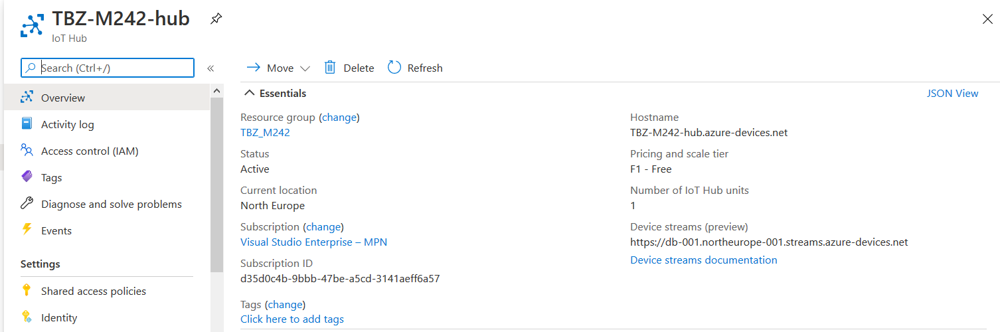
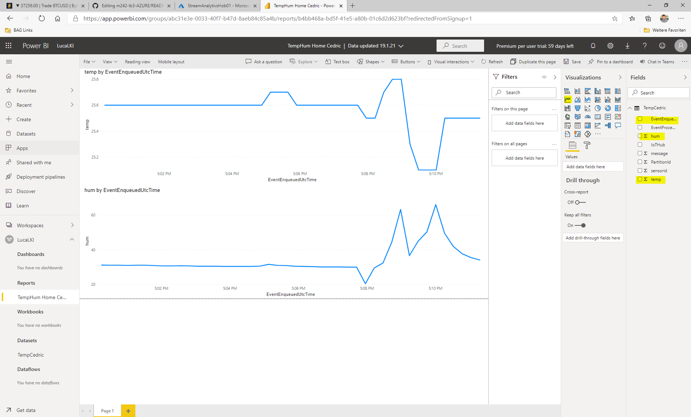

# m242-lb3-AZURE


### Inhaltsverzeichnis
* [Team  Übersicht]()
* [Projektbeschrieb]()
* [Gliederung]()
* [K1](https://github.com/cdrc-kppr/M242-lb3-AZURE#k1)
* [K2](https://github.com/cdrc-kppr/M242-lb3-AZURE#k2)
* [K3](https://github.com/cdrc-kppr/M242-lb3-AZURE#k3)
* [K4](https://github.com/cdrc-kppr/M242-lb3-AZURE#k4)
* [K5](https://github.com/cdrc-kppr/M242-lb3-AZURE#k5)
* [K6](https://github.com/cdrc-kppr/M242-lb3-AZURE#k6)


## Team Übersicht
* Luca Kiefer
* Haris Chandrakumar
* Cedric Kupper

## Projektbeschrieb

## K1
### Umgebung auf eigenem Notebook eingerichtet und voll funktionsfähig
#### Account auf os.mbed.com erstellt
#### Serial Driver installiert
#### Terminal Programm installiert

## K2
### Eigene Lernumgebung ist eingerichtet
#### Dokumentation vorhanden
#### Persönlicher Wissenstand in Bezug auf die wichtigsten Themen ist dokumentiert (IoT, Sensoren, Aktoren, Service)
##### Luca Kiefer
Internet of Things nutzte ich selbst erst als Benutzer wie zum Beispiele mit einer Smartphone App sehe ich mehrere Daten meines Autos. Selber konfiguriert oder sogar programmiert habe ich ein IoT Geräte noch nie.
Mit Services habe ich bis jetzt schon mehr konfiguriert, gewartet und verwaltet. Ich habe bei meiner Arbeit täglich mit Azure und natürlich Azure Services zu tun. 
Von VPN bis zu AAD usw.
##### Cedric Kupper 
IoT war bei mir bis jetzt noch nicht so richtig im Vordergrund. Ich habe es ausser für ein Paar LEDs in meinem Zimmer nie tichtig benutzt. Ich habe bereits mal ein Raspberry für meine Firma eingerichtet, hatte da aber sehr viel unterstützung und musste nicht viel selber machen. Mit Services arbeite ich zwar nicht täglich aber immer mal wieder im Büro (AZURE usw.)

##### Haris Chandrakumar
IoT Gerät habe ich noch nie selber konfiguriert. Im ZLI hatte ich mit Raspberry zutun dort hat uns der Lehrer gezeigt was man alles konfigurieren kann und was er schon mit diesem Gerät gemacht hat. Selber Konfigurieren konnten wir aber nicht nur theoretisch anschauen konnten wir da er nicht genug Geräte hatte.

#### Wichtige Lernschritte sind dokumentiert
##### Luca Kiefer
* 16.12.2020
** IoT Gerät kennegelernt
* 06.01.2021
** Azure Cloud einferichtet
*** - Hub und Devices
*** - Azuer Hub mit IoT Gerät verbunden
##### Cedric Kupper
* 16.12.2021
** IoT Gerät (K64F) kennegelernt
** Die ersten Programme Kompiliert
* 06.01.2021
** Cloud Service mit AZURE kennengelertn
** Programm mit Online Compiler Kompiliert
** MBED Studio kennengelernt
** Cloud Programm mit MBED Studio Komopiliert und installiert
##### Haris Chandrakumar
* 16.12.2021
** IoT Gerät (K64F) kennegelernt
** Die ersten Programme Kompiliert
* 06.01.2021
** Cloud Service mit AZURE kennengelernt
** MBED Studio kennengelernt

#### Anhand der Dokumentation können Dritte das Projekt nachbauen


## K3
### IoTKit
#### Beispiel Programm verwendet
##### Azure 
* IoT Hub erstellt:


* In IoT Hub ein Device erstellt


* "Primary Connection String" kopiert und in [mbed_app.json](link) kopiert 


##### IoTKit
* MBED Studio installiert
* DOWNLOAD LINK: https://os.mbed.com/studio/
* Das IoT Kit angeschlossen und das Cloud Programm importiert. 
* Auf "File" klicken und "Import Programm" wählen                                                                                                                                    
                                                                                                                                    

* Die Git-Hub URL des "Cloud" Dienstes einfügen und einen Namen vergeben, dann importieren                                                                                                                                    
                                                                                                                                    

* Um das IoT Kit anzuhängen, unter "Target", rechts unten auf das blaue Icon klicken                                                                                                                                                
                                                                                                                                                

* Dann bei "USB-Device" das Kit auswählen das Build Target überprüfen, wenn alles stimmt, auf "Save All" klicken                                                                                                                                                
                                                                                                                                                

* Nun ist das IoT Kit unter "Targets" mitt dem vorhin vergebenen Namen gespeichert. Wählt es aus                                                                                                                                                
                                                                                                                                                

#### Beispiel Programm geringfügig abgeändert, z.B. nur URL 
* Das .json file anpassn, doppel klick und warten bis es sich öffnet                                                                                                                                                
                                                                                                                                                

* Nun die eigenschaften und den AZURE Link einfügen                                                                                                                                                
                                                                                                                                                
                                                                                                                                                

* Zum schluss auf das "Play" Icon klicken und warten biss das Programm fertig Installiert wurde                                                                                                                                                
                                                                                                                                                

#### Beispiel Programm erweitert, z.B. mehr Sensordaten senden oder andere Daten.
* Das gerät Sendet die Temperatur daten an AZURE                                                                                                                                                
   

Um zu Testen ob die Daten ankommen bitte mit Azure CLI folgende Befehle ausführen:

```
az login
az extension add --name azure-iot
az iot hub monitor-events --hub-name <IoT Hub Name> --props all
```
  

## K4
### Gateway / Edge
#### Auswertung der Daten in PowerBI
 

* Consumer Gruppe zu IoT hub hinzufügen
 

* Stream Analytics Job erstellen
  

* Input und Output zum Stream Analytics Job hinzufügen
-> verlinkung mit IoT Hub
  
 

* Query anpassen
  

* -> Start des Jobs

* In PowerBi Daten erfassen
* -> Report erstellen (Gelb markiert beachten)

  


##### Ergebniss
  

## K5
### (Cloud) Dienst
#### (Cloud) Dienst aus den Beispielen verwendet
#### Neuen, welcher nicht in den Beispielen vorkommt, Dienst verwendet
#### Eigenen (Cloud) Dienst implementiert
#### Kommunikation erfolgt verschlüsselt, z.B. mittels HTTPSoder mittels VPN
Kommunikation erfolgt verschlüsselt mit MQTT

## K6
### Zusätzliche Bewertungspunkte
#### Allgemein (Kreativität, Komplexität, Um-fang)
#### Umsetzung eigener Ideen
#### Persönlicher Lernentwicklung (Vergleich Vorwissen –Wissenszuwachs)
###### Luca Kiefer
* MBED STudio kennengelernt
* IoT Kit inbetriebnahme kennengelertn
* GitHub Skills erweitert
* Azure IoT Hub kennegerlernt und konfiguriert 
* Azure Stream Analytics kennegelernt und umgesetzt
* Einbindung in PowerBi
* PowerBI gestaltung

###### Cedric Kupper
* MBED STudio kennengelernt
* IoT Kit inbetriebnahme kennengelertn
* GitHub Skills erweitert
* AZURE noch einwenig vertieft kennengelernt

##### Haris Chandrakumar
* MBED STudio kennengelernt
* IoT Kit inbetriebnahme kennengelernt
* GitHub Skills erweitert
* AZURE noch einwenig vertieft kennengelernt


#### Reflexion
###### Luca Kiefer

Das Modul hat mir sehr spass gemacht. Ich konnte viel über IoT kennenlernen und konfigurieren. Die Anbindung ins Azure hat nach einigen schwierigkeiten funktioniert. Besonder Spass hat mir die Einbindung der Daten ins PowerBI.
Das Endergebniss fand ich sehr cool und hat mich mit Stolz erfühlt.
Meine GitHub Skills konnte ich auch erweitern.

Das arbeiten im Teams hat sehr gut funktioniert. Wir haben die Aufgaben fair verteilt.

###### Cedric Kupper
Ich konnte sehr vieles über das IoT Kit K64F lernen. Es hat siel spass gemacht die Erfolge zusehen und es war ein super Gefühl, als zum Schluss alles funktioniert hat. Jetzt kann ich schon sehr gut damit umgehen. Ich konnte durch ausprobieren, ein wenig recherche und etwas Hilfe von meinen Teamkameraden sehr viel über MBED Studio und seine Funktionen dazulernen. Auch mit Git-Hub, bzw. Versionsverwaltungstools hab ich noch einen besseren überblick erhalten.  Mitlerweile habe ich ein gutes Wissen und kann relativ gut damit umgehen.

Die zusammenarbeit im Team hat sehr gut funktioniert. Die aufgaben wurden gerecht aufgeteilt und dementsprechen umgesetzt.

Das Projekt hat mich sehr gut weitergebracht. Ich denke ich werde sehr vieles davon (IoT) in der Zukunft brauchen können. Auch Git-Hub, für gute, einfache und übersichtliche Dokumentationen.


##### Haris Chandrakumar
Ich hatte im Betrieb bisher nichts zu tun mit IoT Kit K64F. Meine einzige Erfahrung war jetzt im BIST aber dafür konnte ich etwas neues lernen was ich auch interessant fand. Ich konnte durch Ausprobieren und durch Hilfe von meinen Teammitgliedern und Recherche im Internet sehr schnell lernen, wie es funktioniert. Ab und zu mussten wir uns gegenseitig helfen aber zum Glück verstand auch jeder was er machte.

Da wir nicht zum ersten Mal als Team zusammenarbeiten konnten wir die Arbeiten schnell zuteilen und eine Deadline setzten, woran sich auch jeder im Team halten konnte. Das gesamte Projekt haben wir auf GitHub sauber dokumentiert.

